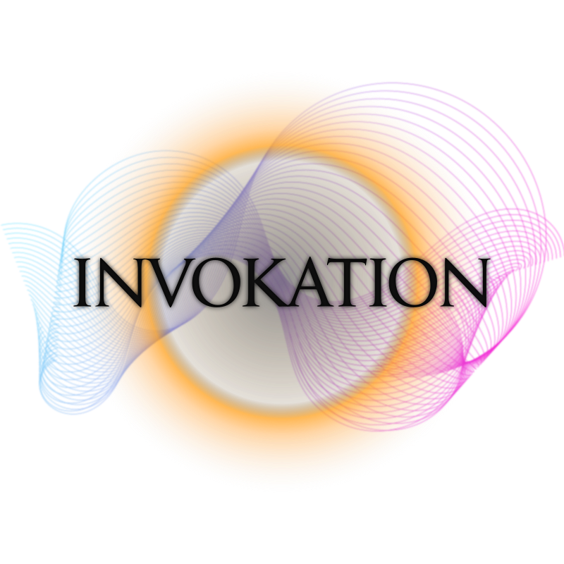

  

<h2 align="center">Invokation School of Arcane Arts</h2>

  <em>"I am a beacon of knowledge blazing out across a black sea of ignorance."</em> — Carl

## Intro

Welcome to Invokation, the School of Arcane Arts!

Training grounds for novices and masters alike, where they learn, practice and master the invocation and casting of spells (and magical items too!).

The first objective is to provide a curated arsenal of simple and effective magic combos as a starting point for the students. Apprentices are guided through lessons that are presented in an educational and most refined manner, allowing the practitioners to progress not only very swiftly, but also very elegantly.

Thank you for showing interest in our school. You can [fill the subscription form][workshop] and start your lessons right away!

## Under construction (Probably, Maybe, Hopefully™)

Although the school owner (and current curator, maintainer, ward, accountant, public relations officer, janitor, security chief, valet... among other things) shows to be proud about the school's opening, the estimated proprietor is not completely satisfied with its simplicity. His future plans for this enterprise include (but not limited to), (also not in any particular order), (he makes no promises):

- [ ] Facilitate the access of information in the curated collection of combos, by providing mechanisms to search for specific content.
- [ ] Gather and file students preferences, so every practice session is prepared with their individual tastes observed. We take care of things like where to place magical items, the student concentrates on the lesson.
- [ ] Improve the cleaning up after each session. We don't want to risk having invoked creatures or discarded magical items lying around.
- [ ] Create a space to give total freedom to students and let them practice and learn without the bounds and limits of lessons.
- [ ] Incorporate recommended orb recipes for each lesson to the learning material.
- [ ] Make lessons more challenging by introducing a time factor besides the already present sequence factor.
- [ ] Implement procedures to accept material suggestions and curatorship from experts in an automated way, with the aim to create a robust library of combos made by the community.
- [ ] Allow practitioners to record their own experiences during practice sessions, give them tools to organize, editorialize and publish their findings to the community library.
- [ ] Allow attendants access to the community library, see each other's work, test, practice and judge it.

## Release Notes

See the [CHANGELOG][changelog].

---

<em>The information presented by the school is not intended or implied to be a substitute for professional magical advice, training or certification. All content, including text books, graphics, diagrams, images and information, contained on or available through the school's material corpus (the “CORPUS”) is for general information purposes only. Invokation School of Arcane Arts Company, and our affiliated entities (collectively, “ISAAC” or “We”) make no representation and assume no responsibility for the accuracy of information contained on or available through the CORPUS, and such information is subject to change without notice. You are encouraged to confirm any information obtained from or through the CORPUS with other sources, including magi, archmagi, sages, charmers, conjurers (or conjurors), enchanters, magicians, necromancers, sorcerers, voodooists, witches, wizards, crystal gazers, diviners, foreseers, fortune-tellers, prognosticators, prophesiers, prophets, seers, soothsayers, mediums, exorcists, shamans, shamanists, witch doctors, warlocks, thaumaturges, theurgists and wonder-workers. NEVER DISREGARD PROFESSIONAL MAGICAL ADVICE OR DELAY SEEKING MAGICAL TREATMENT BECAUSE OF SOMETHING YOU HAVE READ ON OR ACCESSED THROUGH THE CORPUS.</em>

<em>ISAAC does not recommend, endorse or make any representation about the efficacy, appropriateness or suitability of any specific spells, magic items, invocations, mana regenerating methods, cooldown reducers, clickbait thumbnails on Sumiya YouTube videos, arcane providers or other information that may be contained on or available through the CORPUS. NEITHER ISAAC, NOR Arsenal Magus Carl, ARE RESPONSIBLE OR LIABLE FOR ANY ADVICE, COURSE OF INVOCATION, ORB MIXTURES OR ANY OTHER INFORMATION, SERVICES OR MAGICAL PRODUCTS THAT YOU OBTAIN THROUGH THE CORPUS, AND NO MAGUS-PUPIL RELATIONSHIP MAY BE ESTABLISHED THROUGH THE SCHOOL.</em>

[dota2]: https://dota2.com
[invoker]: https://dota2.gamepedia.com/Invoker
[workshop]: https://steamcommunity.com/sharedfiles/filedetails/?id=1809587874
[changelog]: ./CHANGELOG.md
